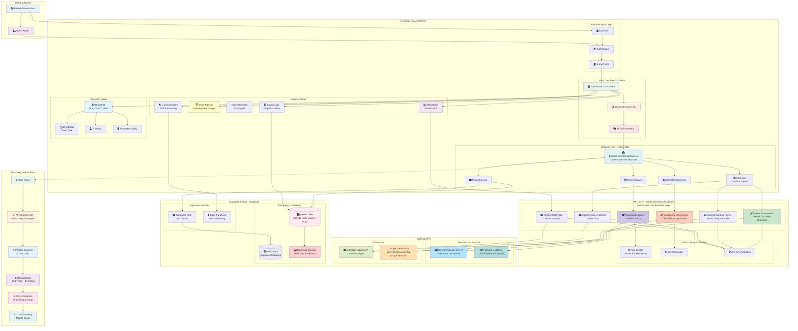

# ABCResearch Architecture Diagram

Complete system architecture showing all components, their relationships, and data flow.

```mermaid
graph TB
    subgraph "Users & Access"
        U[fa:fa-users Biotech Researchers]
        GUEST[fa:fa-user-clock Guest Mode]
    end
    
    subgraph "Frontend - React 19 SPA"
        subgraph "Authentication Layer"
            AUTH[fa:fa-lock AuthForm]
            ENTRY[fa:fa-door-open EntryChoice]
            AUTHCTX[fa:fa-key AuthContext]
        end
        
        subgraph "Main Dashboard & Views"
            DASH[fa:fa-dashboard Dashboard Component]
            SEARCH[fa:fa-search Centered Search Bar]
            CHAT[fa:fa-comments AI Chat Interface]
        end
        
        subgraph "Research Views"
            DRUGS[fa:fa-pills DrugsList<br/>Drug-Centric View]
            DRUGDET[fa:fa-microscope DrugDetail<br/>Deep Dive]
            TRIALS[fa:fa-flask TrialsList]
            PAPERS[fa:fa-file-alt PapersDiscovery]
        end
        
        subgraph "Analysis Views"
            MARKET[fa:fa-chart-line MarketMap<br/>Visualization]
            PIPELINE[fa:fa-project-diagram Asset Pipeline<br/>Development Stages]
            SLIDE[fa:fa-presentation Slide Generator<br/>AI Analysis]
            SAVED[fa:fa-save SavedMaps<br/>Projects Gallery]
            EXTRACT[fa:fa-file-pdf Data Extraction<br/>PDF Processing]
        end
        
        subgraph "Services Layer - Client Side"
            GATHER[fa:fa-network-wired GatherSearchResultsService<br/>Orchestrates All Searches]
            CTSERV[fa:fa-dna ClinicalTrialsService]
            PAPSERV[fa:fa-book PapersService]
            AISERV[fa:fa-brain AIService<br/>Claude & Gemini]
            PROJSERV[fa:fa-folder ProjectService]
        end
    end
    
    subgraph "API Layer - Vercel Serverless Functions"
        subgraph "API Proxies - No Business Logic"
            APIENHANCE[fa:fa-magic /api/enhance-search<br/>Gemini Discovery Strategies]
            APICT[fa:fa-vial /api/search-clinical-trials<br/>ClinicalTrials.gov Proxy]
            APIPUB[fa:fa-graduation-cap /api/search-papers<br/>PubMed Proxy]
            APIDRUG[fa:fa-capsules /api/extract-drug-names<br/>Gemini Drug Extraction]
            APICHAT[fa:fa-robot /api/generate-response<br/>Claude Chat]
            APISLIDE[fa:fa-chart-pie /api/generate-slide<br/>Claude Analysis]
        end
        
        subgraph "Rate Limiting & Security"
            RATE[fa:fa-traffic-light Rate Limiter<br/>350ms PubMed Delay]
            CORS[fa:fa-shield-alt CORS Handler]
            KEYS[fa:fa-key API Key Protection]
        end
    end
    
    subgraph "External APIs"
        subgraph "Medical Data Sources"
            CTGOV[fa:fa-hospital ClinicalTrials.gov API v2<br/>250+ Trials per Search]
            PUBMED[fa:fa-university PubMed E-utilities<br/>150+ Papers per Search]
        end
        
        subgraph "AI Services"
            CLAUDE[fa:fa-brain Anthropic Claude API<br/>Chat & Analysis]
            GEMINI[fa:fa-sparkles Google Gemini API<br/>Query Enhancement & Drug Extraction]
        end
    end
    
    subgraph "Database & Auth - Supabase"
        subgraph "PostgreSQL Database"
            PROJ_TABLE[(fa:fa-database projects table<br/>JSONB: trials, papers, drugs)]
            AUTH_TABLE[(fa:fa-users auth.users<br/>Supabase Managed)]
            RLS[fa:fa-lock Row Level Security<br/>User Data Protection]
        end
        
        subgraph "Supabase Services"
            SUPA_AUTH[fa:fa-id-card Supabase Auth<br/>JWT Tokens]
            EDGE_FN[fa:fa-bolt Edge Functions<br/>PDF Processing]
        end
    end
    
    subgraph "Discovery Search Flow"
        FLOW1[1. User Query]
        FLOW2[2. AI Enhancement<br/>5 Discovery Strategies]
        FLOW3[3. Parallel Searches<br/>10 API Calls]
        FLOW4[4. Deduplication<br/>~150 Trials, ~80 Papers]
        FLOW5[5. Drug Extraction<br/>20-25 Unique Drugs]
        FLOW6[6. Local Grouping<br/>Map to Drugs]
        
        FLOW1 --> FLOW2
        FLOW2 --> FLOW3
        FLOW3 --> FLOW4
        FLOW4 --> FLOW5
        FLOW5 --> FLOW6
    end
    
    %% User Flow
    U --> AUTH
    U --> GUEST
    AUTH --> AUTHCTX
    GUEST --> AUTHCTX
    AUTHCTX --> ENTRY
    ENTRY --> DASH
    
    %% Dashboard Interactions
    DASH --> SEARCH
    SEARCH --> CHAT
    CHAT --> GATHER
    
    %% View Mode Switches
    DASH --> DRUGS
    DASH --> MARKET
    DASH --> PIPELINE
    DASH --> SAVED
    DASH --> EXTRACT
    
    %% Research View Details
    DRUGS --> DRUGDET
    DRUGS --> TRIALS
    DRUGS --> PAPERS
    
    %% Service Layer Orchestration
    GATHER --> CTSERV
    GATHER --> PAPSERV
    GATHER --> AISERV
    GATHER --> PROJSERV
    
    %% Service to API Calls
    AISERV --> APIENHANCE
    CTSERV --> APICT
    PAPSERV --> APIPUB
    AISERV --> APIDRUG
    AISERV --> APICHAT
    MARKET --> APISLIDE
    
    %% API Security
    APIENHANCE --> KEYS
    APICT --> CORS
    APIPUB --> RATE
    APIDRUG --> KEYS
    APICHAT --> KEYS
    APISLIDE --> KEYS
    
    %% External API Connections
    APIENHANCE --> GEMINI
    APICT --> CTGOV
    APIPUB --> PUBMED
    APIDRUG --> GEMINI
    APICHAT --> CLAUDE
    APISLIDE --> CLAUDE
    
    %% Database Operations
    PROJSERV --> SUPA_AUTH
    SUPA_AUTH --> AUTH_TABLE
    PROJSERV --> PROJ_TABLE
    PROJ_TABLE --> RLS
    SAVED --> PROJ_TABLE
    EXTRACT --> EDGE_FN
    
    %% Discovery Flow Connection
    GATHER -.-> FLOW1
    
    style U fill:#e3f2fd
    style GUEST fill:#f3e5f5
    style DASH fill:#e8f5e9
    style SEARCH fill:#fff3e0
    style CHAT fill:#fce4ec
    style DRUGS fill:#e1f5fe
    style MARKET fill:#f3e5f5
    style PIPELINE fill:#fff9c4
    style GATHER fill:#e0f2f1
    style APIENHANCE fill:#c8e6c9
    style APICT fill:#ffccbc
    style APIPUB fill:#d1c4e9
    style CTGOV fill:#b3e5fc
    style PUBMED fill:#b2dfdb
    style CLAUDE fill:#dcedc8
    style GEMINI fill:#ffe0b2
    style PROJ_TABLE fill:#ffebee
    style AUTH_TABLE fill:#e8eaf6
    style RLS fill:#ffcdd2
    style FLOW1 fill:#e8f5e9
    style FLOW2 fill:#fff3e0
    style FLOW3 fill:#e3f2fd
    style FLOW4 fill:#f3e5f5
    style FLOW5 fill:#fce4ec
    style FLOW6 fill:#e0f2f1
```

