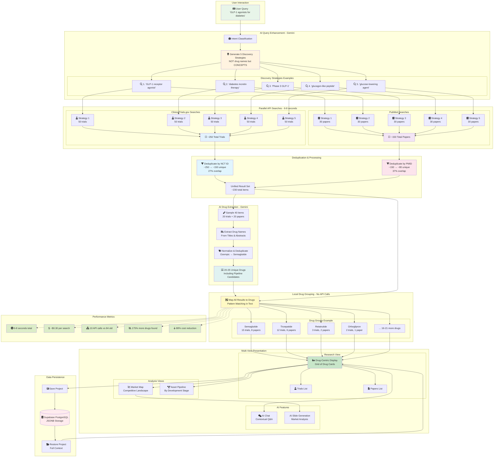

# ABCResearch Data Flow Diagram

Complete data flow from user query through AI enhancement, parallel searches, deduplication, drug extraction, and multi-view presentation.

```mermaid
graph TB
    subgraph "User Interaction"
        QUERY[fa:fa-keyboard User Query<br/>'GLP-1 agonists for diabetes']
    end
    
    subgraph "AI Query Enhancement - Gemini"
        INTENT[fa:fa-brain Intent Classification]
        STRATEGIES[fa:fa-lightbulb Generate 5 Discovery Strategies<br/>NOT drug names but CONCEPTS]
        
        subgraph "Discovery Strategies Examples"
            S1[fa:fa-search 1. 'GLP-1 receptor agonist']
            S2[fa:fa-search 2. 'diabetes incretin therapy']
            S3[fa:fa-search 3. 'Phase 3 GLP-1']
            S4[fa:fa-search 4. 'glucagon-like peptide']
            S5[fa:fa-search 5. 'glucose-lowering agent']
        end
    end
    
    subgraph "Parallel API Searches - 6-8 seconds"
        subgraph "ClinicalTrials.gov Searches"
            CT1[fa:fa-flask Strategy 1<br/>50 trials]
            CT2[fa:fa-flask Strategy 2<br/>50 trials]
            CT3[fa:fa-flask Strategy 3<br/>50 trials]
            CT4[fa:fa-flask Strategy 4<br/>50 trials]
            CT5[fa:fa-flask Strategy 5<br/>50 trials]
            CTUNION[fa:fa-compress ~250 Total Trials]
        end
        
        subgraph "PubMed Searches"
            PM1[fa:fa-book Strategy 1<br/>30 papers]
            PM2[fa:fa-book Strategy 2<br/>30 papers]
            PM3[fa:fa-book Strategy 3<br/>30 papers]
            PM4[fa:fa-book Strategy 4<br/>30 papers]
            PM5[fa:fa-book Strategy 5<br/>30 papers]
            PMUNION[fa:fa-compress ~150 Total Papers]
        end
    end
    
    subgraph "Deduplication & Processing"
        CTDEDUP[fa:fa-filter Deduplicate by NCT ID<br/>~250 → ~150 unique<br/>27% overlap]
        PMDEDUP[fa:fa-filter Deduplicate by PMID<br/>~150 → ~80 unique<br/>37% overlap]
        MERGE[fa:fa-merge Unified Result Set<br/>~230 total items]
    end
    
    subgraph "AI Drug Extraction - Gemini"
        SAMPLE[fa:fa-vial Sample 40 items<br/>20 trials + 20 papers]
        EXTRACT[fa:fa-capsules Extract Drug Names<br/>From Titles & Abstracts]
        NORMALIZE[fa:fa-tags Normalize & Deduplicate<br/>Ozempic → Semaglutide]
        DRUGLIST[fa:fa-list 20-25 Unique Drugs<br/>Including Pipeline Candidates]
    end
    
    subgraph "Local Drug Grouping - No API Calls"
        GROUP[fa:fa-object-group Map All Results to Drugs<br/>Pattern Matching in Text]
        
        subgraph "Drug Groups Example"
            DG1[Semaglutide<br/>15 trials, 8 papers]
            DG2[Tirzepatide<br/>12 trials, 6 papers]
            DG3[Retatrutide<br/>3 trials, 2 papers]
            DG4[Orforglipron<br/>2 trials, 1 paper]
            DGMORE[... 16-21 more drugs]
        end
    end
    
    subgraph "Multi-View Presentation"
        subgraph "Research View"
            DRUGVIEW[fa:fa-pills Drug-Centric Display<br/>Grid of Drug Cards]
            TRIALVIEW[fa:fa-flask Trials List]
            PAPERVIEW[fa:fa-file-alt Papers List]
        end
        
        subgraph "Analysis Views"
            MARKETMAP[fa:fa-chart-line Market Map<br/>Competitive Landscape]
            ASSETPIPE[fa:fa-project-diagram Asset Pipeline<br/>By Development Stage]
        end
        
        subgraph "AI Features"
            CHAT[fa:fa-comments AI Chat<br/>Contextual Q&A]
            SLIDE[fa:fa-presentation AI Slide Generation<br/>Market Analysis]
        end
    end
    
    subgraph "Data Persistence"
        SAVE[fa:fa-save Save Project]
        DATABASE[(fa:fa-database Supabase PostgreSQL<br/>JSONB Storage)]
        RESTORE[fa:fa-folder-open Restore Project<br/>Full Context]
    end
    
    subgraph "Performance Metrics"
        PERF1[fa:fa-tachometer-alt 6-8 seconds total]
        PERF2[fa:fa-dollar-sign ~$0.30 per search]
        PERF3[fa:fa-network-wired 10 API calls vs 84 old]
        PERF4[fa:fa-chart-bar 175% more drugs found]
        PERF5[fa:fa-arrow-down 88% cost reduction]
    end
    
    %% Query Flow
    QUERY --> INTENT
    INTENT --> STRATEGIES
    STRATEGIES --> S1
    STRATEGIES --> S2
    STRATEGIES --> S3
    STRATEGIES --> S4
    STRATEGIES --> S5
    
    %% Parallel Searches
    S1 --> CT1
    S2 --> CT2
    S3 --> CT3
    S4 --> CT4
    S5 --> CT5
    
    S1 --> PM1
    S2 --> PM2
    S3 --> PM3
    S4 --> PM4
    S5 --> PM5
    
    %% Union Results
    CT1 --> CTUNION
    CT2 --> CTUNION
    CT3 --> CTUNION
    CT4 --> CTUNION
    CT5 --> CTUNION
    
    PM1 --> PMUNION
    PM2 --> PMUNION
    PM3 --> PMUNION
    PM4 --> PMUNION
    PM5 --> PMUNION
    
    %% Deduplication
    CTUNION --> CTDEDUP
    PMUNION --> PMDEDUP
    CTDEDUP --> MERGE
    PMDEDUP --> MERGE
    
    %% Drug Extraction
    MERGE --> SAMPLE
    SAMPLE --> EXTRACT
    EXTRACT --> NORMALIZE
    NORMALIZE --> DRUGLIST
    
    %% Local Grouping
    DRUGLIST --> GROUP
    MERGE --> GROUP
    GROUP --> DG1
    GROUP --> DG2
    GROUP --> DG3
    GROUP --> DG4
    GROUP --> DGMORE
    
    %% Display
    DG1 --> DRUGVIEW
    DG2 --> DRUGVIEW
    DG3 --> DRUGVIEW
    DG4 --> DRUGVIEW
    DGMORE --> DRUGVIEW
    
    DRUGVIEW --> TRIALVIEW
    DRUGVIEW --> PAPERVIEW
    DRUGVIEW --> MARKETMAP
    DRUGVIEW --> ASSETPIPE
    
    %% AI Features
    DRUGVIEW --> CHAT
    MARKETMAP --> SLIDE
    
    %% Persistence
    DRUGVIEW --> SAVE
    SAVE --> DATABASE
    DATABASE --> RESTORE
    RESTORE --> DRUGVIEW
    
    %% Performance Connection
    GROUP -.-> PERF1
    GROUP -.-> PERF2
    GROUP -.-> PERF3
    GROUP -.-> PERF4
    GROUP -.-> PERF5
    
    style QUERY fill:#e8f5e9
    style STRATEGIES fill:#fff3e0
    style CTUNION fill:#e3f2fd
    style PMUNION fill:#f3e5f5
    style CTDEDUP fill:#e1f5fe
    style PMDEDUP fill:#fce4ec
    style DRUGLIST fill:#e0f2f1
    style GROUP fill:#fff9c4
    style DRUGVIEW fill:#c8e6c9
    style DATABASE fill:#ffebee
    style PERF1 fill:#dcedc8
    style PERF2 fill:#dcedc8
    style PERF3 fill:#dcedc8
    style PERF4 fill:#dcedc8
    style PERF5 fill:#dcedc8
```

