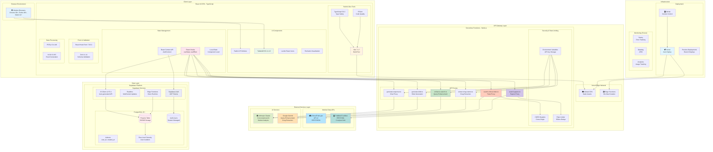

# ABCResearch Tech Stack Diagram

Complete technology stack from client layer through API gateway, external services, data layer, and infrastructure.

```mermaid
graph TB
    subgraph "Client Layer"
        subgraph "Browser Environment"
            BROWSER[fa:fa-globe Modern Browsers<br/>Chrome 90+, Firefox 88+, Safari 14+]
        end
        
        subgraph "React 19 SPA - TypeScript"
            subgraph "UI Components"
                RADIX[Radix UI Primitives]
                TAILWIND[TailwindCSS 4.1.13]
                LUCIDE[Lucide React Icons]
                RECHARTS[Recharts Visualization]
            end
            
            subgraph "State Management"
                HOOKS[React Hooks<br/>useState, useEffect]
                CONTEXT[React Context API<br/>AuthContext]
                LOCAL[Local State<br/>Component Level]
            end
            
            subgraph "Build & Dev Tools"
                VITE[Vite 7.1.7<br/>Build Tool]
                TS[TypeScript 5.8.3<br/>Type Safety]
                ESLINT[ESLint<br/>Code Quality]
            end
            
            subgraph "Form & Validation"
                RHF[React Hook Form 7.63.0]
                ZOD[Zod 4.1.11<br/>Schema Validation]
            end
            
            subgraph "Data Processing"
                PDFJS[PDF.js 5.4.149]
                XLSX[XLSX 0.18.5<br/>Excel Generation]
            end
        end
    end
    
    subgraph "API Gateway Layer"
        subgraph "Vercel Edge Network"
            CDN[fa:fa-cloud Global CDN<br/>Static Assets]
            EDGE[fa:fa-globe-americas Edge Functions<br/>30s Max Duration]
        end
        
        subgraph "Serverless Functions - Node.js"
            subgraph "API Proxies"
                FN1[enhance-search.ts<br/>Query Enhancement]
                FN2[search-clinical-trials.ts<br/>Trials Proxy]
                FN3[search-papers.ts<br/>Papers Proxy]
                FN4[extract-drug-names.ts<br/>Drug Extraction]
                FN5[generate-response.ts<br/>Chat Proxy]
                FN6[generate-slide.ts<br/>Slide Generation]
            end
            
            subgraph "Security & Rate Limiting"
                CORS_H[CORS Headers<br/>Cross-Origin]
                RATE_L[Rate Limiter<br/>350ms Delays]
                ENV[Environment Variables<br/>API Key Storage]
            end
        end
    end
    
    subgraph "External Services Layer"
        subgraph "Medical Data APIs"
            CTAPI[fa:fa-hospital ClinicalTrials.gov<br/>API v2<br/>REST/JSON]
            PMAPI[fa:fa-university PubMed E-utilities<br/>REST/XML<br/>3 req/sec limit]
        end
        
        subgraph "AI Services"
            CLAUDE_API[fa:fa-brain Anthropic Claude<br/>Conversational AI<br/>Market Analysis]
            GEMINI_API[fa:fa-sparkles Google Gemini<br/>Query Enhancement<br/>Drug Extraction]
        end
    end
    
    subgraph "Data Layer"
        subgraph "Supabase Platform"
            subgraph "PostgreSQL 15+"
                TABLES[(Projects Table<br/>JSONB Storage)]
                USERS[(Auth.Users<br/>System Managed)]
                INDEXES[Indexes<br/>user_id, created_at]
                RLS_POL[Row Level Security<br/>User Isolation]
            end
            
            subgraph "Supabase Services"
                AUTH_SVC[Supabase Auth<br/>JWT Tokens]
                REALTIME[Realtime<br/>WebSocket Updates]
                EDGE_FNS[Edge Functions<br/>Deno Runtime]
                CLIENT[JS Client v2.57.4<br/>Auto-generated API]
            end
        end
    end
    
    subgraph "Infrastructure"
        subgraph "Deployment"
            GITHUB[fa:fa-github GitHub<br/>Version Control]
            VERCEL_D[fa:fa-rocket Vercel<br/>Auto Deploy]
            PREVIEW[Preview Deployments<br/>Branch Deploys]
        end
        
        subgraph "Monitoring (Future)"
            SENTRY[Sentry<br/>Error Tracking]
            DATADOG[Datadog<br/>APM]
            ANALYTICS[Analytics<br/>Usage Tracking]
        end
    end
    
    %% Browser to React
    BROWSER --> RADIX
    BROWSER --> TAILWIND
    
    %% React to Services
    HOOKS --> FN1
    HOOKS --> FN2
    HOOKS --> FN3
    HOOKS --> FN4
    HOOKS --> FN5
    HOOKS --> FN6
    
    %% Build Process
    VITE --> CDN
    TS --> VITE
    ESLINT --> VITE
    
    %% API Gateway to External
    FN1 --> GEMINI_API
    FN2 --> CTAPI
    FN3 --> PMAPI
    FN4 --> GEMINI_API
    FN5 --> CLAUDE_API
    FN6 --> CLAUDE_API
    
    %% Security
    FN2 --> CORS_H
    FN3 --> RATE_L
    ENV --> FN1
    ENV --> FN4
    ENV --> FN5
    ENV --> FN6
    
    %% Data Layer
    CONTEXT --> AUTH_SVC
    AUTH_SVC --> USERS
    HOOKS --> CLIENT
    CLIENT --> TABLES
    TABLES --> RLS_POL
    EDGE_FNS --> TABLES
    
    %% Deployment
    GITHUB --> VERCEL_D
    VERCEL_D --> EDGE
    VERCEL_D --> CDN
    
    style BROWSER fill:#e3f2fd
    style VITE fill:#fff3e0
    style TAILWIND fill:#e8f5e9
    style HOOKS fill:#fce4ec
    style FN1 fill:#c8e6c9
    style FN2 fill:#ffccbc
    style FN3 fill:#d1c4e9
    style CTAPI fill:#b3e5fc
    style PMAPI fill:#b2dfdb
    style CLAUDE_API fill:#dcedc8
    style GEMINI_API fill:#ffe0b2
    style TABLES fill:#ffebee
    style AUTH_SVC fill:#e8eaf6
    style VERCEL_D fill:#e1f5fe
```

