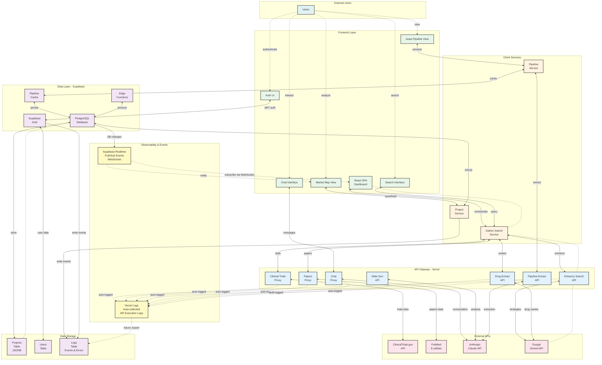

# Simplified Architecture with Bidirectional Flow

Simplified view of the ABCResearch architecture emphasizing bidirectional data flow and request-response patterns between layers.

## Component Ownership

This section maps team members to the architectural elements, interfaces, and interactions they own based on git commit history and implementation work.

### Fredrik Willumsen Haug - Owner

#### Elements
- **ChatAPI** (line 31) - Chat Proxy API Gateway
  - File: `api/generate-response.ts`
  - Implemented dynamic AI conversation with memory (ABC-41)
  - Added conversation context and intelligent search term extraction (ABC-45, ABC-46)

- **ChatUI** (line 15) - Chat Interface component
  - File: `src/components/Dashboard.tsx` (chat sections)
  - Manages conversation history and context display
  - Sends chatHistory to ChatAPI for memory-based responses

- **ProjectService** (line 23) - Project Management Service
  - Files: Project-related sections in Dashboard
  - Handles project creation, storage, and switching
  - State management for research projects

#### Interfaces
- **ChatUI ↔ ChatAPI** (line 85) - Bidirectional message flow
  - Passes user queries with conversation history
  - Returns dynamic AI responses with search suggestions
  - Implemented full conversation memory system

- **ProjectService ↔ PostgreSQL** (line 101) - CRUD operations
  - Project persistence and retrieval
  - JSONB storage in ProjectsTable

#### Interactions
- **ChatAPI ↔ Claude** (line 96) - Conversation API integration
  - Dynamic prompt engineering for natural conversations
  - Context-aware response generation
  - Search intent detection and term extraction

- **Users ↔ ChatUI** (line 64) - User interaction
  - Chat interface for medical research queries
  - Context management and display

#### Documentation
- Architecture diagrams and documentation
- Created simplified bidirectional architecture diagram
- Added logging and pub/sub bus documentation
- Comprehensive system documentation updates

---

### Sofie Yang - Owner

#### Elements
- **PipelineAPI** (line 33) - Pipeline Extract API Gateway
  - File: `api/generate-asset-pipeline-table.ts`
  - LLM-powered asset development pipeline extraction
  - Generates structured pipeline data from research

- **PipelineUI** (line 16) - Asset Pipeline View component
  - File: `src/components/AssetDevelopmentPipeline.tsx`
  - Displays asset development pipeline tables
  - Interactive drug-specific research modals

- **EnhanceAPI** (line 27) - Enhance Search API Gateway
  - File: `api/enhance-search.ts`
  - Search strategy enhancement using Gemini 2.5 Flash Lite
  - Phase-based clinical trial query optimization

- **DrugAPI** (line 30) - Drug Extract API Gateway
  - File: `api/extract-drug-names.ts`
  - Drug name extraction from research queries
  - LLM-based entity recognition

- **GatherService** (line 21) - Gather Search Service
  - File: `src/services/gatherSearchResults.ts`
  - Orchestrates multi-source search operations
  - Coordinates trials and papers retrieval

- **PipelineService** (line 22) - Pipeline Service
  - File: `src/services/pipelineLLMService.ts`
  - Asset pipeline data processing
  - Cache management for pipeline results

- **SearchUI / DrugsList** - Search result display
  - File: `src/components/DrugsList.tsx`
  - Drug-specific search and filtering
  - Integration with pipeline views

#### Interfaces
- **PipelineUI ↔ PipelineService** (line 70) - Process pipeline data
  - Requests pipeline extraction for research
  - Displays structured asset development information

- **PipelineService ↔ PipelineAPI** (line 88) - Extract pipeline data
  - Sends research context to API for extraction
  - Returns structured pipeline tables

- **PipelineService ↔ Cache** (line 89) - Cache operations
  - Stores pipeline results for performance
  - Retrieves cached pipeline data

- **SearchUI ↔ GatherService** (line 78) - Query coordination
  - User search requests
  - Multi-source result aggregation

- **GatherService ↔ EnhanceAPI** (line 79) - Enhance search queries
  - Search strategy optimization
  - Query refinement using LLM

- **GatherService ↔ TrialsAPI** (line 80) - Clinical trials retrieval
  - Phase-specific trial searches
  - Enhanced query parameters

- **GatherService ↔ DrugAPI** (line 82) - Extract drug names
  - Drug entity extraction from queries
  - Drug-specific search coordination

#### Interactions
- **PipelineAPI ↔ Claude** (line 98) - Pipeline extraction
  - LLM-based structured data extraction
  - Asset development pipeline generation

- **EnhanceAPI ↔ Gemini** (line 92) - Search strategies
  - Query enhancement using Gemini 2.5 Flash Lite
  - Clinical trial search optimization

- **DrugAPI ↔ Gemini** (line 95) - Drug name extraction
  - Entity recognition for pharmaceutical terms
  - Drug name normalization

- **Users ↔ PipelineUI** (line 65) - View pipeline
  - Asset development pipeline visualization
  - Interactive research exploration

- **Users ↔ SearchUI** (line 63) - Search interaction
  - Multi-source medical research search
  - Drug-specific filtering and exploration

#### Testing & Quality
- Integration tests for clinical trials search with Phase parameter
- Unit tests for drug extraction
- API transparency and query logging

---

### Shared / Infrastructure (Both)

#### Elements
- **ReactApp** (line 12) - Main Dashboard orchestration
  - File: `src/components/Dashboard.tsx`
  - Both contributors modified for different features
  - Central state management and coordination

#### External Dependencies (Neither team member owns - third-party)
- **ClinicalTrials.gov API** (line 37) - External data source
- **PubMed E-utilities** (line 38) - External data source
- **Anthropic Claude API** (line 39) - External LLM service
- **Google Gemini API** (line 40) - External LLM service
- **Supabase Auth** (line 44) - External auth service
- **PostgreSQL** (line 45) - External database service

---

## Task Mapping

### ABC-41: Implement Dynamic AI Response Generation in ChatAPI
**Owner:** Fredrik Willumsen Haug  
**Element:** ChatAPI (line 31) - API Gateway - Vercel layer  
**Interface:** ChatUI ↔ ChatAPI (line 85) - Bidirectional message flow  
**External Dependency:** ChatAPI ↔ Claude (line 96) - Conversation API integration

**Implementation:**
- Enhance ChatAPI to accept and process conversation history
- Update ChatUI to send chatHistory with each request
- Replace rigid intent-based prompting with dynamic conversational AI
- Improve response quality and naturalness

**Files:**
- `api/generate-response.ts` - ChatAPI implementation
- `src/components/Dashboard.tsx` - ChatUI integration
- `api/utils/chatHelpers.ts` - Conversation memory helpers
- `src/test/chatHelpers.test.ts` - Unit tests

### ABC-45: Fix Search Term Extraction
**Owner:** Fredrik Willumsen Haug  
**Type:** Bug Fix  
**Component:** ChatAPI helper functions

**Implementation:**
- Filter conversational words from search queries
- Improved term extraction accuracy

### ABC-46: Intelligent Medical Term Detection
**Owner:** Fredrik Willumsen Haug  
**Type:** Bug Fix / Enhancement  
**Component:** ChatAPI helper functions

**Implementation:**
- Positive signal detection for medical terms
- Filter past tense verbs and generic nouns
- Recognize medical codes (GLP-1, IL-6, COVID-19)
- Detect medical suffixes (-mab, -itis, -osis)

