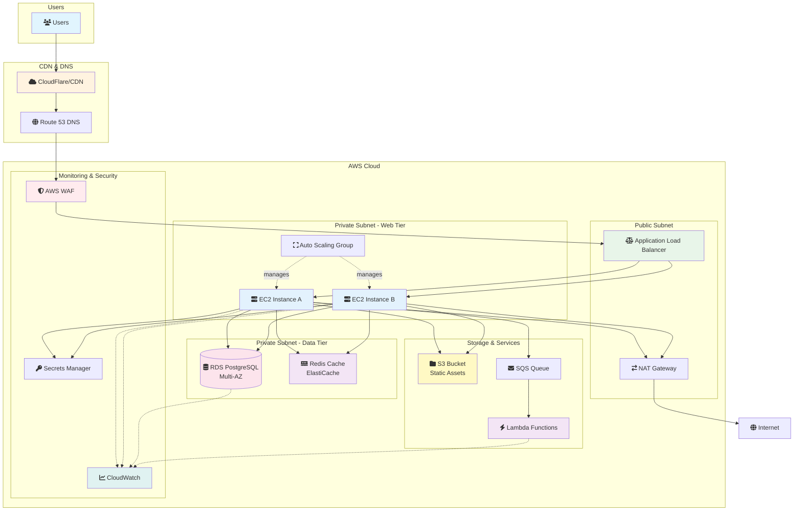

# Architecture Example Diagram

Generic AWS cloud architecture example showing common patterns for web applications.

```mermaid
graph TB
    subgraph "Users"
        U[fa:fa-users Users]
    end
    
    subgraph "CDN & DNS"
        CF[fa:fa-cloud CloudFlare/CDN]
        R53[fa:fa-globe Route 53 DNS]
    end
    
    subgraph "AWS Cloud"
        subgraph "Public Subnet"
            ALB[fa:fa-balance-scale Application Load Balancer]
            NAT[fa:fa-exchange NAT Gateway]
        end
        
        subgraph "Private Subnet - Web Tier"
            EC2A[fa:fa-server EC2 Instance A]
            EC2B[fa:fa-server EC2 Instance B]
            ASG[fa:fa-expand Auto Scaling Group]
        end
        
        subgraph "Private Subnet - Data Tier"
            RDS[(fa:fa-database RDS PostgreSQL<br/>Multi-AZ)]
            REDIS[fa:fa-memory Redis Cache<br/>ElastiCache]
        end
        
        subgraph "Storage & Services"
            S3[fa:fa-folder S3 Bucket<br/>Static Assets]
            SQS[fa:fa-envelope SQS Queue]
            LAMBDA[fa:fa-bolt Lambda Functions]
        end
        
        subgraph "Monitoring & Security"
            CW[fa:fa-chart-line CloudWatch]
            WAF[fa:fa-shield-alt AWS WAF]
            SM[fa:fa-key Secrets Manager]
        end
    end
    
    U --> CF
    CF --> R53
    R53 --> WAF
    WAF --> ALB
    ALB --> EC2A
    ALB --> EC2B
    EC2A --> RDS
    EC2B --> RDS
    EC2A --> REDIS
    EC2B --> REDIS
    EC2A --> S3
    EC2B --> S3
    EC2A --> SQS
    SQS --> LAMBDA
    EC2A --> SM
    EC2B --> SM
    EC2A -.-> CW
    EC2B -.-> CW
    RDS -.-> CW
    LAMBDA -.-> CW
    EC2A --> NAT
    EC2B --> NAT
    NAT --> Internet[fa:fa-globe Internet]
    
    ASG -.manages.-> EC2A
    ASG -.manages.-> EC2B
    
    style U fill:#e1f5fe
    style CF fill:#fff3e0
    style ALB fill:#e8f5e9
    style EC2A fill:#e3f2fd
    style EC2B fill:#e3f2fd
    style RDS fill:#fce4ec
    style REDIS fill:#f3e5f5
    style S3 fill:#fff9c4
    style CW fill:#e0f2f1
    style WAF fill:#ffebee
    style LAMBDA fill:#f3e5f5
```

