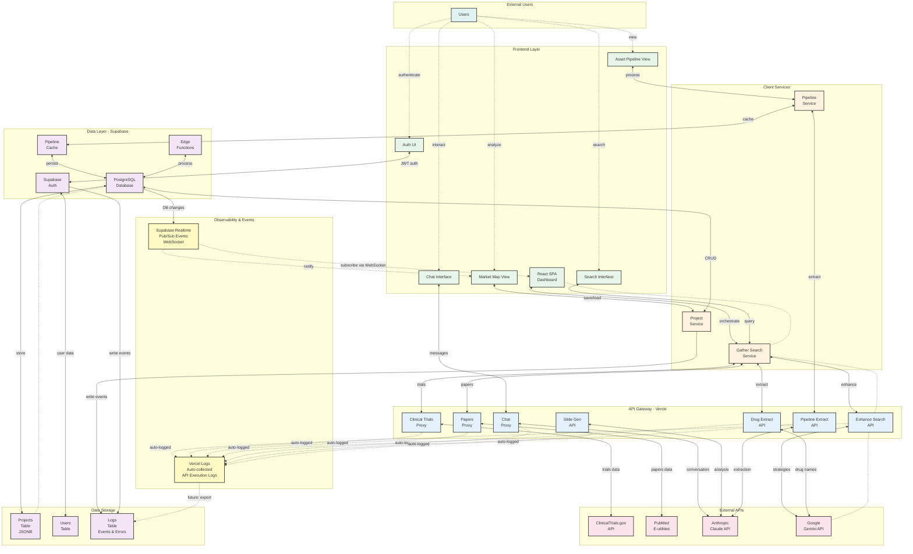

# Simplified Architecture with Bidirectional Flow

Simplified view of the ABCResearch architecture emphasizing bidirectional data flow and request-response patterns between layers.

```mermaid
graph TB
    subgraph "External Users"
        Users[Users]
    end
    
    subgraph "Frontend Layer"
        ReactApp[React SPA<br/>Dashboard]
        AuthUI[Auth UI]
        SearchUI[Search Interface]
        ChatUI[Chat Interface]
        PipelineUI[Asset Pipeline View]
        MarketUI[Market Map View]
    end
    
    subgraph "Client Services"
        GatherService[Gather Search<br/>Service]
        PipelineService[Pipeline<br/>Service]
        ProjectService[Project<br/>Service]
    end
    
    subgraph "API Gateway - Vercel"
        EnhanceAPI[Enhance Search<br/>API]
        TrialsAPI[Clinical Trials<br/>Proxy]
        PapersAPI[Papers<br/>Proxy]
        DrugAPI[Drug Extract<br/>API]
        ChatAPI[Chat<br/>Proxy]
        SlideAPI[Slide Gen<br/>API]
        PipelineAPI[Pipeline Extract<br/>API]
    end
    
    subgraph "External APIs"
        ClinicalTrials[ClinicalTrials.gov<br/>API]
        PubMed[PubMed<br/>E-utilities]
        Claude[Anthropic<br/>Claude API]
        Gemini[Google<br/>Gemini API]
    end
    
    subgraph "Data Layer - Supabase"
        AuthService[Supabase<br/>Auth]
        PostgreSQL[PostgreSQL<br/>Database]
        Cache[Pipeline<br/>Cache]
        EdgeFunc[Edge<br/>Functions]
    end
    
    subgraph "Data Storage"
        ProjectsTable[Projects<br/>Table<br/>JSONB]
        UsersTable[Users<br/>Table]
        LogsTable[Logs<br/>Table<br/>Events & Errors]
    end
    
    subgraph "Observability & Events"
        VercelLogs[Vercel Logs<br/>Auto-collected<br/>API Execution Logs]
        RealtimeEvents[Supabase Realtime<br/>Pub/Sub Events<br/>WebSocket]
    end
    
    %% User interactions
    Users -.->|authenticate| AuthUI
    Users -.->|search| SearchUI
    Users -.->|interact| ChatUI
    Users -.->|view| PipelineUI
    Users -.->|analyze| MarketUI
    
    %% Frontend to Services (bidirectional)
    ReactApp <-->|orchestrate| GatherService
    PipelineUI <-->|process| PipelineService
    MarketUI <-->|save/load| ProjectService
    
    %% Auth flow (bidirectional)
    AuthUI <-->|JWT auth| AuthService
    AuthService <-->|user data| UsersTable
    
    %% Search flow (bidirectional request-response)
    SearchUI <-->|query| GatherService
    GatherService <-->|enhance| EnhanceAPI
    GatherService <-->|trials| TrialsAPI
    GatherService <-->|papers| PapersAPI
    GatherService <-->|extract| DrugAPI
    
    %% Chat flow (bidirectional)
    ChatUI <-->|messages| ChatAPI
    
    %% Pipeline extraction (bidirectional)
    PipelineService <-->|extract| PipelineAPI
    PipelineService <-->|cache| Cache
    
    %% API Gateway to External APIs (bidirectional)
    EnhanceAPI <-->|strategies| Gemini
    TrialsAPI <-->|trials data| ClinicalTrials
    PapersAPI <-->|papers data| PubMed
    DrugAPI <-->|drug names| Gemini
    ChatAPI <-->|conversation| Claude
    SlideAPI <-->|analysis| Claude
    PipelineAPI <-->|extraction| Claude
    
    %% Project persistence (bidirectional)
    ProjectService <-->|CRUD| PostgreSQL
    PostgreSQL <-->|store| ProjectsTable
    
    %% Cache operations (bidirectional)
    Cache <-->|persist| PostgreSQL
    
    %% PDF processing
    EdgeFunc <-->|process| PostgreSQL
    
    %% API Gateway Logging (automatic)
    EnhanceAPI -.->|auto-logged| VercelLogs
    TrialsAPI -.->|auto-logged| VercelLogs
    PapersAPI -.->|auto-logged| VercelLogs
    DrugAPI -.->|auto-logged| VercelLogs
    ChatAPI -.->|auto-logged| VercelLogs
    SlideAPI -.->|auto-logged| VercelLogs
    PipelineAPI -.->|auto-logged| VercelLogs
    
    %% Application Event Logging (explicit)
    ProjectService -->|write events| LogsTable
    AuthService -->|write events| LogsTable
    
    %% Realtime Events via Supabase
    PostgreSQL -->|DB changes| RealtimeEvents
    RealtimeEvents -.->|subscribe via WebSocket| ReactApp
    RealtimeEvents -.->|notify| MarketUI
    
    %% Future: Custom Logs Export
    VercelLogs -.->|future: export| LogsTable
    
    %% Interface dots at major connection points
    ReactApp -..- GatherService
    GatherService -..- EnhanceAPI
    EnhanceAPI -..- Gemini
    PostgreSQL -..- ProjectsTable
    
    %% Styling
    classDef frontend fill:#e8f5e9,stroke:#333,stroke-width:2px
    classDef service fill:#fff3e0,stroke:#333,stroke-width:2px
    classDef api fill:#e3f2fd,stroke:#333,stroke-width:2px
    classDef external fill:#fce4ec,stroke:#333,stroke-width:2px
    classDef database fill:#f3e5f5,stroke:#333,stroke-width:2px
    classDef user fill:#e0f2f1,stroke:#333,stroke-width:2px
    classDef logging fill:#fff9c4,stroke:#333,stroke-width:2px
    
    class ReactApp,AuthUI,SearchUI,ChatUI,PipelineUI,MarketUI frontend
    class GatherService,PipelineService,ProjectService service
    class EnhanceAPI,TrialsAPI,PapersAPI,DrugAPI,ChatAPI,SlideAPI,PipelineAPI api
    class ClinicalTrials,PubMed,Claude,Gemini external
    class AuthService,PostgreSQL,Cache,EdgeFunc,ProjectsTable,UsersTable,LogsTable database
    class Users user
    class VercelLogs,RealtimeEvents logging
```

