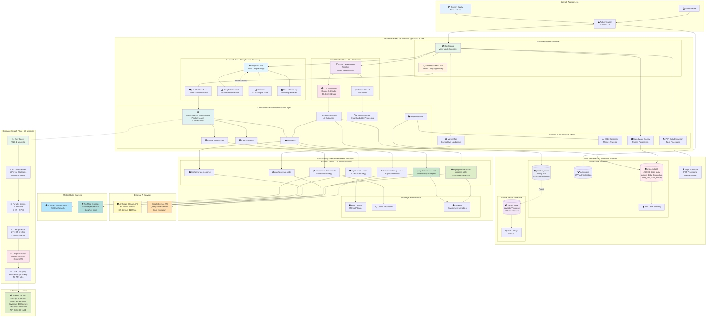

# Single Overarching Architecture

Comprehensive single-diagram view of the entire ABCResearch platform, including all layers from users to database, with discovery flow and performance metrics.

```mermaid
graph TB
    subgraph "Users & Access Layer"
        U[fa:fa-users Biotech Equity Researchers]
        GUEST[fa:fa-user-clock Guest Mode]
        AUTH_FLOW[fa:fa-lock Authentication<br/>JWT-Based]
    end
    
    subgraph "Frontend - React 19 SPA with TypeScript & Vite"
        subgraph "Main Dashboard Controller"
            DASH[fa:fa-dashboard Dashboard<br/>View Mode Controller]
            SEARCH_BAR[fa:fa-search Centered Search Bar<br/>Natural Language Query]
        end
        
        subgraph "Research View - Drug-Centric Discovery"
            CHAT[fa:fa-comments AI Chat Interface<br/>Claude Conversational]
            DRUGS[fa:fa-pills DrugsList Grid<br/>20-25 Unique Drugs]
            DRUGDET[fa:fa-microscope DrugDetail Modal<br/>sourceGroupId Match]
            TRIALS[fa:fa-flask TrialsList<br/>~150 Unique Trials]
            PAPERS[fa:fa-file-alt PapersDiscovery<br/>~80 Unique Papers]
        end
        
        subgraph "Asset Pipeline View - LLM Enhanced"
            PIPELINE[fa:fa-project-diagram Asset Development Pipeline<br/>Stage Classification]
            PATTERN_EXT[fa:fa-code Pattern-Based<br/>Extraction]
            LLM_EXT[fa:fa-brain LLM Extraction<br/>Claude 3.5 Haiku<br/>$0.046/10 drugs]
        end
        
        subgraph "Analysis & Visualization Views"
            MARKET[fa:fa-chart-line MarketMap<br/>Competitive Landscape]
            SLIDE[fa:fa-presentation AI Slide Generator<br/>Market Analysis]
            SAVED[fa:fa-save SavedMaps Gallery<br/>Project Persistence]
            EXTRACT[fa:fa-file-pdf PDF Data Extraction<br/>Table Processing]
        end
        
        subgraph "Client-Side Service Orchestration Layer"
            GATHER[fa:fa-network-wired GatherSearchResultsService<br/>Parallel Search Orchestration]
            CTSERV[fa:fa-dna ClinicalTrialsService]
            PAPSERV[fa:fa-book PapersService]
            AISERV[fa:fa-robot AIService]
            PROJSERV[fa:fa-folder ProjectService]
            PIPE_SERV[fa:fa-cogs PipelineService<br/>Drug Candidate Processing]
            PIPE_LLM[fa:fa-sparkles PipelineLLMService<br/>AI Extraction]
        end
    end
    
    subgraph "API Gateway - Vercel Serverless Functions"
        subgraph "Pure API Proxies - No Business Logic"
            APIENHANCE[fa:fa-magic /api/enhance-search<br/>5 Discovery Strategies]
            APICT[fa:fa-vial /api/search-clinical-trials<br/>50 results/strategy]
            APIPUB[fa:fa-graduation-cap /api/search-papers<br/>30 results/strategy]
            APIDRUG[fa:fa-capsules /api/extract-drug-names<br/>Drug Normalization]
            APICHAT[fa:fa-robot /api/generate-response]
            APISLIDE[fa:fa-chart-pie /api/generate-slide]
            APIPIPELINE[fa:fa-table /api/generate-asset-pipeline-table<br/>Structured Extraction]
        end
        
        subgraph "Security & Performance"
            RATE[fa:fa-traffic-light Rate Limiting<br/>350ms PubMed]
            CORS[fa:fa-shield-alt CORS Protection]
            ENV_KEYS[fa:fa-key API Keys<br/>Environment Variables]
        end
    end
    
    subgraph "External AI Services"
        CLAUDE[fa:fa-brain Anthropic Claude API<br/>3.5 Haiku: $28/mo<br/>3.5 Sonnet: $105/mo]
        GEMINI[fa:fa-sparkles Google Gemini API<br/>Query Enhancement<br/>Drug Extraction]
    end
    
    subgraph "Medical Data Sources"
        CTGOV[fa:fa-hospital ClinicalTrials.gov API v2<br/>~250 trials/search]
        PUBMED[fa:fa-university PubMed E-utilities<br/>~150 papers/search<br/>3 req/sec limit]
    end
    
    subgraph "Data Persistence - Supabase Platform"
        subgraph "PostgreSQL Database"
            PROJ_TABLE[(fa:fa-database projects table<br/>JSONB: trials_data<br/>papers_data, drugs_data<br/>slide_data, chat_history)]
            AUTH_TABLE[(fa:fa-users auth.users<br/>JWT Authentication)]
            CACHE[(fa:fa-memory pipeline_cache<br/>30-day TTL<br/>80% cost reduction)]
            RLS[fa:fa-lock Row Level Security]
        end
        
        subgraph "Future: Vector Database"
            VECTOR[(fa:fa-cube Vector Store<br/>pgvector/Pinecone<br/>RAG Architecture)]
            EMBED[fa:fa-compress Embeddings<br/>ada-002]
        end
        
        EDGE_FN[fa:fa-bolt Edge Functions<br/>PDF Processing<br/>Deno Runtime]
    end
    
    subgraph "Discovery Search Flow - 6-8 seconds"
        FLOW_QUERY[1. User Query<br/>'GLP-1 agonists']
        FLOW_ENHANCE[2. AI Enhancement<br/>5 Phrase Strategies<br/>NOT drug names]
        FLOW_PARALLEL[3. Parallel Search<br/>10 API calls<br/>5 CT + 5 PM]
        FLOW_DEDUP[4. Deduplication<br/>27% CT overlap<br/>37% PM overlap]
        FLOW_EXTRACT[5. Drug Extraction<br/>Sample 40 items<br/>Gemini API]
        FLOW_GROUP[6. Local Grouping<br/>sourceGroupId linking<br/>No API calls]
        
        FLOW_QUERY --> FLOW_ENHANCE
        FLOW_ENHANCE --> FLOW_PARALLEL
        FLOW_PARALLEL --> FLOW_DEDUP
        FLOW_DEDUP --> FLOW_EXTRACT
        FLOW_EXTRACT --> FLOW_GROUP
    end
    
    subgraph "Performance Metrics"
        METRICS[fa:fa-tachometer-alt Speed: 6-8 sec<br/>Cost: $0.30/search<br/>Drugs: 20-25 found<br/>Coverage: 175% more<br/>Reduction: 88% cost<br/>API Calls: 10 vs 84]
    end
    
    %% User Flow
    U --> AUTH_FLOW
    GUEST --> AUTH_FLOW
    AUTH_FLOW --> DASH
    
    %% Dashboard Navigation
    DASH --> SEARCH_BAR
    SEARCH_BAR --> CHAT
    DASH --> DRUGS
    DASH --> PIPELINE
    DASH --> MARKET
    DASH --> SAVED
    DASH --> EXTRACT
    
    %% Research View Details
    DRUGS --> DRUGDET
    DRUGDET -.sourceGroupId.-> DRUGS
    DRUGS --> TRIALS
    DRUGS --> PAPERS
    
    %% Asset Pipeline Processing
    PIPELINE --> PATTERN_EXT
    PIPELINE --> LLM_EXT
    LLM_EXT --> PIPE_LLM
    PATTERN_EXT --> PIPE_SERV
    
    %% Service Orchestration
    CHAT --> GATHER
    GATHER --> CTSERV
    GATHER --> PAPSERV
    GATHER --> AISERV
    PIPE_LLM --> AISERV
    PROJSERV --> SAVED
    
    %% Service to API Layer
    AISERV --> APIENHANCE
    CTSERV --> APICT
    PAPSERV --> APIPUB
    AISERV --> APIDRUG
    AISERV --> APICHAT
    MARKET --> APISLIDE
    PIPE_LLM --> APIPIPELINE
    
    %% API Security
    APIENHANCE --> ENV_KEYS
    APICT --> CORS
    APIPUB --> RATE
    APIPIPELINE --> ENV_KEYS
    
    %% External API Calls
    APIENHANCE --> GEMINI
    APICT --> CTGOV
    APIPUB --> PUBMED
    APIDRUG --> GEMINI
    APICHAT --> CLAUDE
    APISLIDE --> CLAUDE
    APIPIPELINE --> CLAUDE
    
    %% Database Operations
    PROJSERV --> PROJ_TABLE
    AUTH_FLOW --> AUTH_TABLE
    PROJ_TABLE --> RLS
    SAVED --> PROJ_TABLE
    PIPE_LLM --> CACHE
    EXTRACT --> EDGE_FN
    
    %% Future RAG Connection
    CACHE -.Future.-> VECTOR
    VECTOR -.-> EMBED
    
    %% Discovery Flow Connection
    GATHER -.-> FLOW_QUERY
    
    %% Metrics Connection
    FLOW_GROUP -.-> METRICS
    
    style U fill:#e3f2fd
    style DASH fill:#e8f5e9
    style SEARCH_BAR fill:#fff3e0
    style DRUGS fill:#e1f5fe
    style PIPELINE fill:#f3e5f5
    style LLM_EXT fill:#fce4ec
    style GATHER fill:#e0f2f1
    style APIENHANCE fill:#c8e6c9
    style APIPIPELINE fill:#dcedc8
    style CLAUDE fill:#fff9c4
    style GEMINI fill:#ffe0b2
    style CTGOV fill:#b3e5fc
    style PUBMED fill:#b2dfdb
    style PROJ_TABLE fill:#ffebee
    style CACHE fill:#e8eaf6
    style VECTOR fill:#f3e5f5
    style FLOW_QUERY fill:#e8f5e9
    style FLOW_EXTRACT fill:#fce4ec
    style METRICS fill:#dcedc8
```

